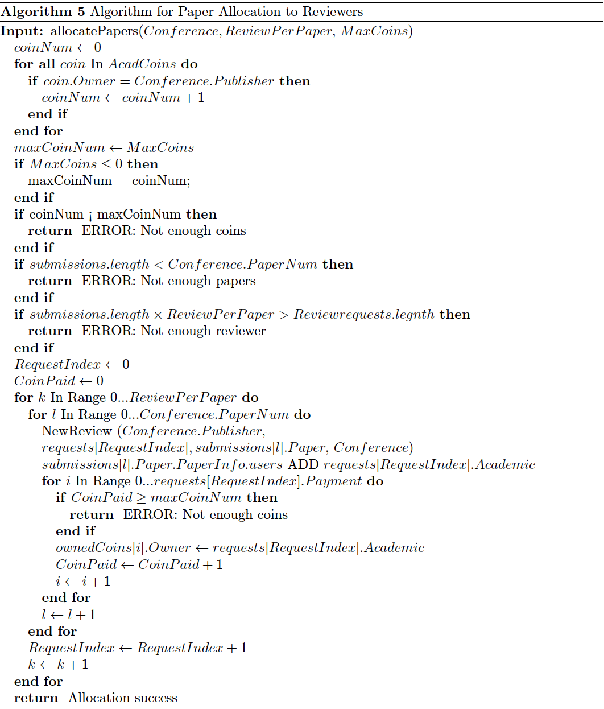

# Table of Contents  
[About](#about) 
[File Description](#file) 
[Setup Instructions](#setup) 
[Resource Model](#ERD) 
[Algorithm Description and Pseudocode](#algorithm) 

<a name="about"/>

ABOUT BLOCKCHAINREVIEW
===========

BlockchainReview is the business network logic of blockchain system based on Hyperledger and InterPlanetary File System (IPFS) that intends to function as the basis of a novel paper review system.

<a name="file"/>

FILE DESCRIPTION
===========

|File Name|Description|
|---|---|
|org.acad.acadpaperreview.cto|Defines the participant and asset types (model) of the system|
|logic.js|Stores functions and helper functions of transactions|
|queries.qry|Database-like queries, used in transactions to find certain participants and assets|
|permissions.acl|Defines the participant's CRUD rights in the system using the Access Control Language (ACL)|

<a name="setup"/>

SETUP INSTRUCTIONS
===========

Prerequisite:
To setup a simulation, the hyperledger composer playground environment is required. This environment can be used online through: [https://composer-playground.mybluemix.net](https://composer-playground.mybluemix.net).

For installing a local environment visit the Hyperledger composer tutorials: [Installing the development environment](https://hyperledger.github.io/composer/v0.19/installing/development-tools).

1. After entering the main interface of Hyperledger Composer Playground Click "Deploy a new business network".

2. On the "Model Network Starter Template" section, choose "empty-business-network".

3. Deploy.

4. Click "Connect now".

5. Use "Add a file" to add files and ensure there is one of the each Model File, Script File, Query File and Access Control File in the Files list.

6. Replace the content of these files with files from this project.

7. Click "Deploy Changes" on the bottom-left side of the screen.

A detailed tutorial about the Hyperledger Composer Playground can be find [here](https://hyperledger.github.io/composer/v0.19/playground/playground-index).

<a name="ERD"/>

RESOURCE MODEL (ERD)
===========

<a name="algorithm"/>

ALGORITHM DESCRIPTION AND PSEUDOCODE
===========

This section presents the seven algorithms used for transactions.

### Algorithm for Creating PaperInfo

The purpose of algorithm 1 is for paper owners to create the relevant PaperInfo storing the information to access the paper document. This transaction/smart contract can only be initiated if the initiator is the paper owner. The input of this algorithm is the IPFSHash and decryption key to access the paper. Also, a reference to the Paper itself is required.

### Algorithm for Paper Subscription

Algorithm 2 is responsible for users to subscribe to a paper. When users are subscribed, they can access the paper through reading the PaperInfo asset. The input for this algorithm is the Paper and the new user. The algorithm checks if the paperInfo exists, the paper is published and the user never subscribed to the paper. Only then the user will be eligible to pay the owner of the paper in the form of AcadCoins. If users have enough coins, they will be added to the subscribed users list stored in the PaperInfo asset.

### Algorithm for Paper Submission

A smart contract algorithm is also used for academics to submit papers to the conferences. Algorithm 3 starts by checking the published state stored on the Paper asset. If the state is "NotPub," indicating the paper has not been published, before it will proceed further. Then, there will be a check on the conference status to ensure that the conference is still open to accepting papers. Next, there will be a match between conference keywords and paper keywords to ensure that the academic is submitting a paper to the correct conference. Then, checking the PaperInfo is created for the Paper and there is another check that whether the paper is submitted to another conference. The algorithm will check if the paper owner or authors has submitted a request to be a reviewer. Obviously, Paper authors cannot be reviewers at the same time on the same conference. With the above check conditions passed, the transaction creates a Submission asset with the paper and the conference. To give access of the paper and its PaperInfo to the Publisher, the publisher will be added to the subscribed user list on the PaperInfo of the paper.

### Algorithm for Reviewer Request

Academics need to send a request to the conference to be a reviewer. Similar to the Paper Submission process, this algorithm also starts by comparing the keywords of the conference and the interest of the academic. Next, the reviewer's rating is checked against the conference's ReviewerRating. Reviewers' rating is calculated by the average of all the ratings they received on their past reviews. These ratings are given by the publisher. After that, the algorithm ensures that the academic hasn't submitted a paper to the conference. Finally, after checking that there isn't an existing request for the conference under that academic, a ReviewRequest item will be created. The paper published status will change to "Submitted." All users including the owner of the paper will not be able to change Paper asset information, once its status changes to "Submitted."

### Algorithm for Paper Allocation to Reviewers

Algorithm 5 will automatically allocate papers to the potential reviewers. After this stage, some academics who received a paper for review will become the official reviewer of the conference and will be paid accordingly. This algorithm requires a reference to the Conference asset, the number of reviewers per paper and the coins the publisher is willing to pay for the conference review. After checking the inputs, the algorithm allocates papers to the reviewers on a first come first serve basis. A paper submitted earlier will be allocated first. A reviewer who sent a request earlier will receive a paper first. After paper distribution, the reviewer will automatically subscribe to the paper to get access. Finally, the reviewer will get paid according to the Payment variable stored in their ReviewRequest.

### Algorithm for Review Submission

Reviewers submit reviews through algorithm 6. Reviewers need to input an IPFS hash of the reviewer document and status of the review. The status is either "Pass" or "Fail." These reviews will be published after the conference is in the state of "End," informing the authors whether their paper is accepted or denied.

### Algorithm for Paper Submission Assessment

The final stage of a paper submission will be the assessment by a publisher. The publisher will change the submission status to either "Pass" or "Fail." If "Pass" the publisher will gain ownership of the paper and the paper published status will change to "Published." In this case, there can be no further modifications to the paper asset. If the paper received "Fail," the paper status will change back to "NotPub" indicating that the paper is not published.

